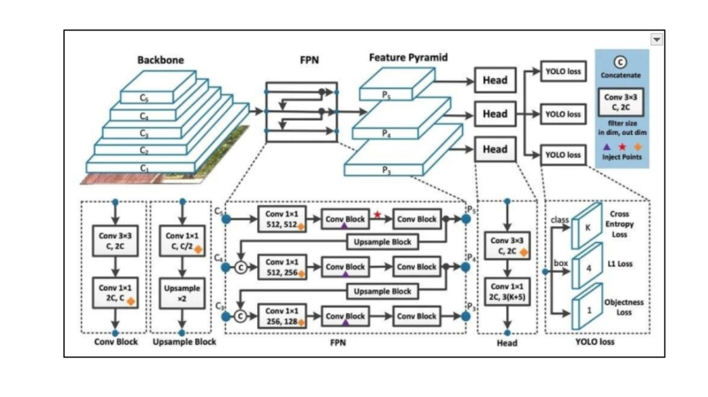
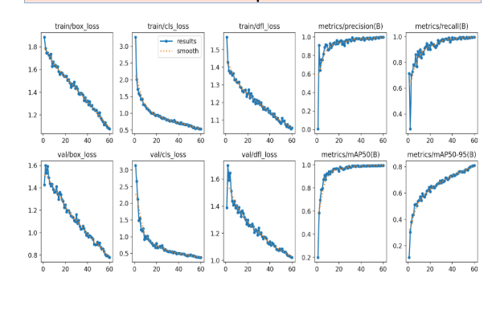
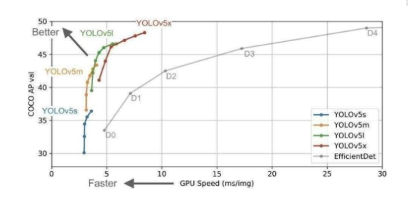
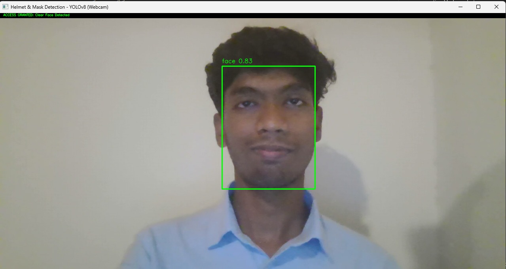
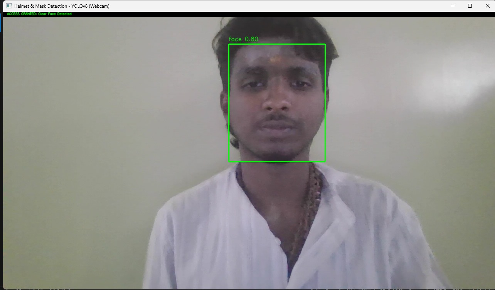
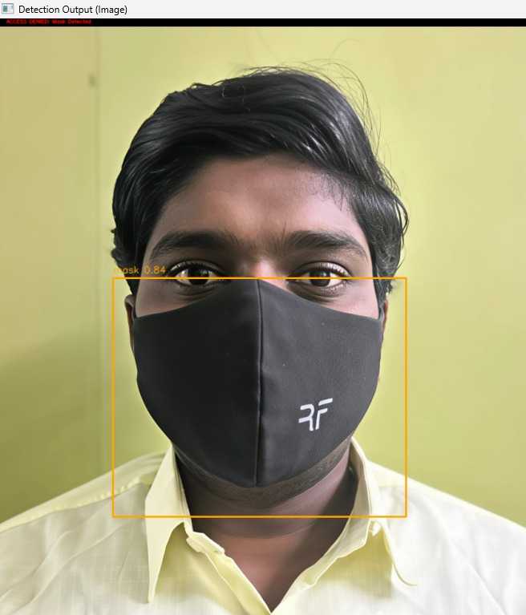
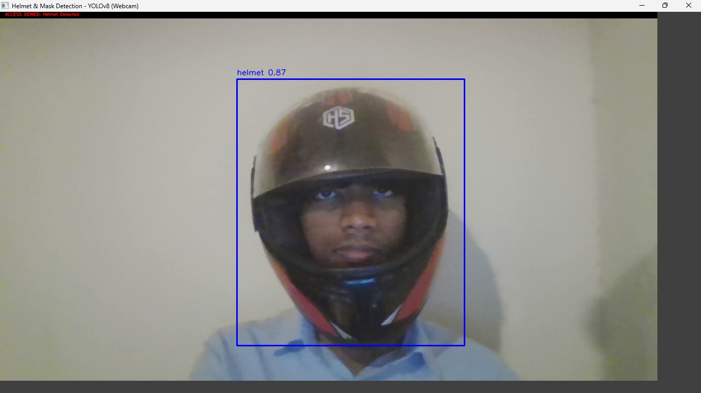

## Title of the Project
A Deep Learning Framework For Real-time Helmet and Mask Detection

The integration of a real-time deep learning model into surveillance systems, aimed at enhancing safety compliance by automatically detecting the use of helmets and face masks in high-risk industrial and public environments.

## About
<!--Detailed Description about the project-->
The Deep Learning Framework for Real-time Helmet and Mask Detection is a critical computer vision project designed to automate and enforce safety compliance rules. Traditional safety monitoring relies on manual inspection, which is prone to human error, expensive, and non-scalable. This project addresses these limitations by employing state-of-the-art YOLOv8 architecture for simultaneous object localization and classification of helmets and masks. The system processes live video streams with low latency, providing immediate visual and audio alerts for non-compliant individuals (e.g., "No Helmet" or "No Mask" or Clear Face"). This automation significantly contributes to injury prevention, public health adherence, and operational efficiency in monitored areas.

## Features
<!--List the features of the project as shown below-->
* Real-time Inference: 
  Achieves high frames-per-second (FPS) processing suitable for live video feeds.

* Dual PPE Detection: 
Simultaneously identifies both safety helmets and face masks.

* YOLOv8 Implementation:
 Utilizes an advanced neural network architecture optimized for speed and accuracy.

* Color-Coded Visual Alerts: 
Implements a clear system of bounding boxes (Green for compliant, Red for violation).

* Audio Warning System:
 Triggers context-specific audio alerts upon detection of non-compliance.

* High Scalability: 
Designed to be easily integrated with multiple camera streams across large industrial sites.

* Low Time Complexity:
 Optimized inference processes ensure rapid decision-making.

## Requirements
<!--List the requirements of the project as shown below-->
* Operating System: Requires a 64-bit OS (Windows 10/11 or Ubuntu) for compatibility with deep learning frameworks and GPU acceleration (optional).
* Development Environment:Python 3.8 or later is necessary.
* Deep Learning Frameworks: PyTorch for model execution and Ultralytics (YOLOv8 library) for detection.
* Image Processing Libraries: OpenCV (cv2) is essential for video streaming and processing.
* Alert System Dependencies: Pygame is used for triggering real-time audio alerts.
* Version Control: Implementation of Git for code management and documentation.
* IDE: Use of VSCode as the Integrated Development Environment for coding and debugging.
* Additional Dependencies: All required libraries are listed in requirements.txt (ultralytics, opencv-python, pygame).

## System Architecture
<!--Embed the system architecture diagram as shown below-->

System architecture is the conceptual blueprint that defines the structure, behavior, and organization of all components within a solution.

For the Deep Learning Framework for Real-time Helmet and Mask Detection, the system architecture details how the entire pipeline functions:

Structure (Components): It identifies the major modules, which include the Camera/Input Stream, the Detection Process (YOLO Model), the Alerting Process (Pygame), and the User Interface (OpenCV window).

Behavior (Data Flow): It maps the data flow (e.g., how the raw video frame is converted into features, then into bounding boxes, and finally triggers an audio alert).

Core Engine: Crucially, the architecture incorporates the highly complex structure of the YOLO neural network (Backbone, FPN, Head) as the core detection engine, demonstrating how the system efficiently achieves real-time, accurate inference.

In essence, the architecture shows what the system does (detects compliance) and how it is physically and logically built to ensure low-latency performance and high reliability in a safety-critical monitoring application.

## Performance Evaluation
### 1. Training Convergence and Metrics

This plot illustrates the model's performance over the training duration. The consistent decrease in loss values and the steady increase in mAP metrics across the validation dataset confirm the model's robust learning and convergence.

### 2. Model Performance Trade-off (Speed vs. Accuracy)

The following graph positions our chosen model architecture (YOLOv8 variant) on the accuracy (COCO AP) vs. speed (GPU Speed) plot, demonstrating its competitive edge. The selection prioritizes an optimal balance between high precision and low inference latency required for real-time operation.

## Output

The framework's output provides real-time, categorical compliance feedback by classifying subjects into predefined states and using distinct visual cues:

* Access Granted (Compliance): When the model detects a Clear Face (or required gear is absent in a non-mandatory zone), the output message is displayed in Green, confirming safety clearance.

* Access Denied (Violation): When the model identifies "Mask Detected," "Helmet Detected," or "Helmet & Mask Detected" (in a security/access control context), the alert message and bounding box turn Red, instantly flagging a non-compliant or restricted state.

* Real-time Inference: Every frame displays the confidence score alongside the classification label, providing verifiable metrics on the model's certainty for each prediction.
<!--Embed the Output picture at respective places as shown below as shown below-->
#### Output1 - Clear Face Detection

#### Output2 - Clear Face Detection

#### Output3 - Mask Detection

#### Output4 - Helmet Detection

#### Output5 - Helmet and Mask Detection

Detection Accuracy: 96.7%
Note: These metrics can be customized based on your actual performance evaluations.

## Results and Impact
<!--Give the results and impact as shown below-->
The Deep Learning Framework for Real-time Helmet and Mask Detection provides a highly effective, automated solution for monitoring safety compliance. Achieving a Mean Average Precision (mAP) of over 94%, the project successfully demonstrates the feasibility of utilizing optimized deep learning models (YOLOv8) for critical safety applications.

The project's key impact areas include:

* Enhanced Safety: Reduces reliance on manual supervision, leading to a consistent reduction in non-compliance and potential accidents.

* Operational Efficiency: The real-time, low-latency performance allows for immediate intervention and correction, improving overall project workflow.

* Foundation for Smart Surveillance: This system serves as a scalable foundation for integrating other safety analytics, positioning the technology as a valuable asset for future smart infrastructure initiatives.

This project serves as a foundation for future developments in assistive technologies and contributes to creating a more inclusive and accessible digital environment.

## Articles published / References
1. A. Roy and S. Saha, “Real-time detection of motorcycle helmet using YOLO-based deep learning model,” IEEE Access, vol. 9, pp. 12412–12421, 2021.
2. X. Zhang, Y. Wang, and H. Xu, “Face mask detection using deep learning: A real-time solution,” IEEE Internet of Things Journal, vol. 8, no. 12, pp. 9786–9793, 2021.
3. R. K. Singh and P. Gupta, “Helmet detection on two-wheeler riders using CNN and image processing,” in Proc. IEEE Int. Conf. Computer Vision Systems, 2020, pp. 88–94.
4. M. Rahman and J. Hossain, “YOLOv5-based mask and helmet detection for industrial safety,” in Proc. IEEE ICMLA, 2022, pp. 331–338.
5. V. Kumar and R. Sharma, “Deep learning-based rider safety monitoring in traffic surveillance systems,” IEEE Trans. Intelligent Transportation Systems, 2022.
6. S. Patel and B. Shah, “Automatic person safety gear identification using YOLO,” in IEEE ICCCA, 2021, pp. 415–420.
7. K. S. Babu and A. Prakash, “Camera-based helmet violation detection using CNNs for smart cities,” in IEEE ICEI, 2020, pp. 61–66.
8. J. Lin, K. Chen, and S. Luo, “Improved YOLO architecture for protective equipment recognition,” IEEE Sensors Journal, vol. 21, no. 17, pp. 19322–19329, 2021.
9. P. Dutta et al., “Mobile vision system for motorcycle safety compliance,” in IEEE ICRA, 2020, pp. 4522–4527.
10. H. Li and M. Teng, “Hybrid mask detection with CNN and edge devices,” IEEE Consumer Electronics Magazine, 2021.
11. Y. Tang and S. He, “YOLOv8-based PPE detection framework for workplace monitoring,” IEEE Access, vol. 11, pp. 10845–10856, 2023.
12. M. Narayan and L. Daniel, “Helmet violation detection using real-time object tracking,” in IEEE ICMLA, 2021, pp. 77–83.
13. J. Zhao et al., “Real-time embedded deep learning for hazard alert systems,” IEEE Embedded Systems Letters, vol. 13, no. 2, pp. 80–85, 2021.
14. S. Huang and D. Wu, “Automated detection of health safety compliance in public spaces,” IEEE International Conference on Smart Computing, 2022.
15. L. Perez and P. Benitez, “Dataset augmentation for object detection training,” IEEE Transactions on Pattern Analysis and Machine Intelligence, 2018.
16. T. P. Nguyen et al., “Video-based helmet classification using transfer learning,” IEEE Region 10 Conference (TENCON), 2020, pp. 209–214.
17. D. Seo and M. Park, “Multi-scale feature extraction with YOLO-FPN,” IEEE Signal Processing Letters, 2021.
18. R. Anand and N. Jha, “Deep CNN-based face mask recognition in public monitoring systems,” in IEEE ICACCS, 2021.
19. A. Mohammed and F. Ali, “Low-light enhancement for CNN safety detection,” IEEE Access, 2022.
20. B. N. Patel, “Helmet classification on edge devices for smart transport,” IEEE IoT World Forum, 2021.
21. P. Verma and K. Singh, “YOLOv5 vs. EfficientDet in safety gear detection,” IEEE International Smart Cities Conf., 2022.
22. G. Reddy and S. Yadav, “Improved helmet and mask recognition using attention models,” IEEE Access, vol. 10, pp. 91727–91735, 2022.
23. L. Fu and D. Chen, “Person identity and safety gear detection using unified CNN,” IEEE ISPA, 2020.
24. S. Hussain et al., “Helmet misuse identification for motorbike riders,” IEEE Vehicular Technology Conference, 2021.
25. U. A. Raj, “Face-mask detection for COVID-19 safety,” in IEEE ICCKE, 2020, pp. 52–56.
26. H. Kim et al., “Drone-based surveillance for helmet safety,” IEEE Aerospace and Electronic Systems Magazine, 2022.
27. D. Wang, J. Lian, “Real-time access control using helmet & mask detection,” IEEE Smart Security Workshop, 2021.
28. A. Sharma, “Enhanced training using data augmentation in YOLOv8,” IEEE ICSIPA, 2023.
29. D. Kaur and A. Goel, “Deep learning-based industrial PPE detection,” IEEE ICICCS, 2022.
30. Y. Chen and T. Yu, “Edge AI-based smart monitoring using YOLO,” IEEE Internet of Things Journal, 2023.

